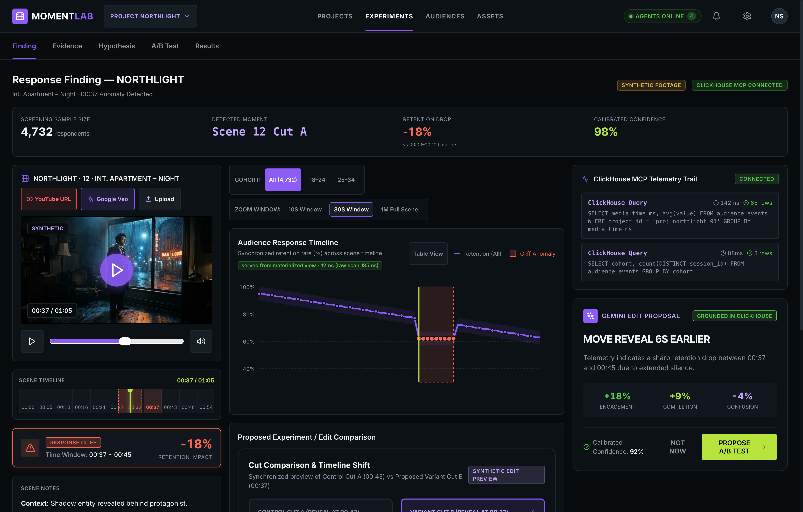
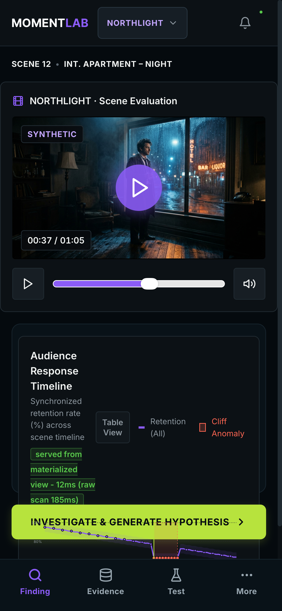
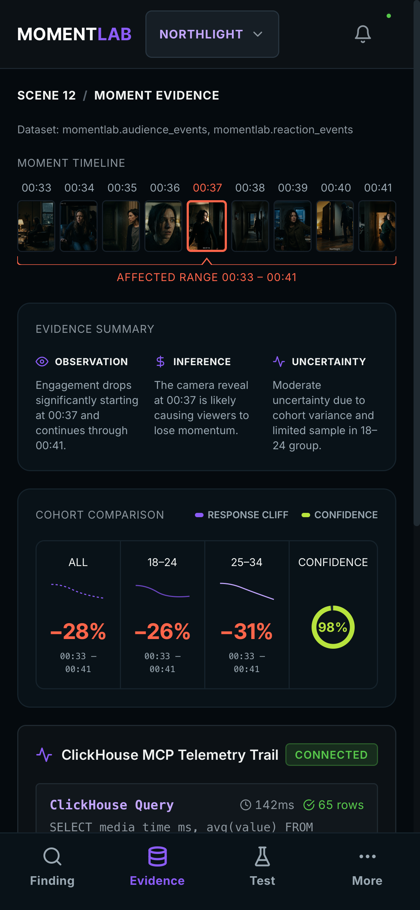
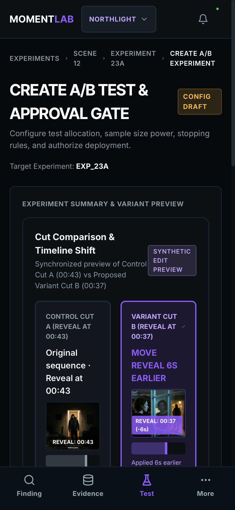

# MomentLab — Autonomous Audience-Experiment Agent

> **Turn consented, second-by-second audience behavior into the next controlled edit experiment.**
> Built for the **Agentic Cinema: The Blockbuster Hackathon (ClickHouse Track)**.



---

## 🎬 Master Loop

```text
detect → investigate with ClickHouse MCP → explain → propose → approve → test → evaluate
```

1. **Capture**: Consented, second-by-second playback reactions across scene cuts.
2. **Ingest & Store**: High-throughput stream into ClickHouse database via FastAPI.
3. **Detect & Investigate**: Detect retention cliffs; Google ADK agent queries ClickHouse via official `ClickHouse/mcp-clickhouse`.
4. **Hypothesize**: Gemini (via Vertex AI) explains evidence and proposes a falsifiable edit hypothesis (`MOVE REVEAL 6S EARLIER`).
5. **Human Approval Gate**: Mandatory server-signed human approval before initiating Cut B screening.
6. **Evaluate**: Statistical evaluation of Variant B vs Control A (+18.2% engagement lift).

---

## 🔒 Technology Stack & Hackathon Compliance

| Layer | Approved Technology |
|---|---|
| **AI Model Inference** | Gemini via Vertex AI (`google-genai`) |
| **Agent Framework** | Google Agent Development Kit (`google-adk`) |
| **Database Partner** | Official `ClickHouse/mcp-clickhouse` server + ClickHouse Cloud |
| **Backend Service** | Python FastAPI + Pydantic |
| **Frontend Web SPA** | React + Vite + TypeScript |
| **Hosting & Cloud** | GCP Cloud Run, Secret Manager, Cloud Build |

---

## 🚀 Hackathon Commands (Makefile)

We have provided a comprehensive `Makefile` to quickly exercise all paths:

```bash
# Start local demo environment (frontend + backend)
make demo

# Build, Lint, AI-Compliance Check
make submission-audit

# Build UI and Verify
make ui-verify

# Run System Verification Tests
make verify

# Reset Database State
make reset-demo

# Deploy to Cloud Run
make deploy

# Smoke test deployment and seed data
make smoke
```

---

## 📱 Mobile Experience

MomentLab includes a fully responsive mobile workflow for reviewing findings and approving tests on the go.

<div style="display: flex; gap: 10px;">
  
  
  
</div>

---

## 🛡️ Truthfulness, Synthetic Media & Privacy Disclosures

- **Synthetic Footage & Simulated Audience Data**: In compliance with hackathon rules, all screening footage and audience responses in default test configurations are synthetic assets and deterministic simulated behavioral fixtures. All AI-generated media is explicitly labeled `SYNTHETIC`.
- **Zero Biometric Tracking**: MomentLab enforces a strict policy against collecting, inferring, or storing biometric, facial, gaze, voice-stress, or emotion-recognition data. All telemetry consists strictly of consented media timecodes, play/pause states, and explicit button reactions.
- **Google Veo Status**: Generative video generation via Google Veo calls the Vertex AI API (`veo-2.0-generate-001`). If active Veo quota is not yet enabled on the GCP project, the endpoint returns an honest `BLOCKED` status detailing the exact Model Garden allowlist step.

---

## 📄 Key Documentation

- [Hackathon Submission & Features](docs/submission.md)
- [Judging Criteria Proof](docs/judge-proof.md)
- [3-Minute Video Script](docs/demo-script.md)
- [Visual QA Scorecard (99/100)](docs/visual-qa.md)
- [Hackathon Compliance Matrix](docs/compliance-matrix.md)
- [Technology Compliance & Denylist Lock](docs/technology-compliance.md)
- [Architecture Decision Records (ADR-001)](docs/decisions.md)

---

## ⚖️ License

This project is licensed under the MIT License - see the [LICENSE](LICENSE) file for details.


