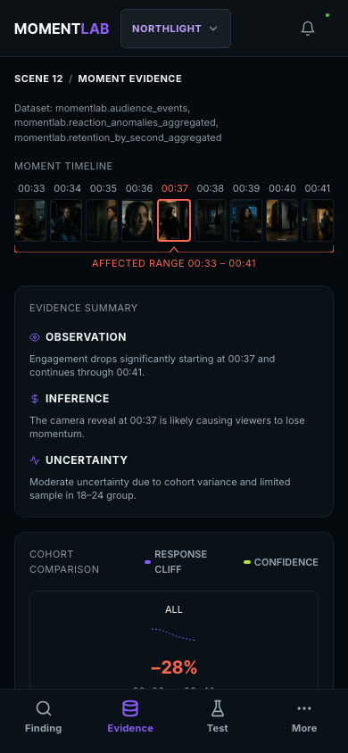

# MomentLab

Turn consented, second-by-second audience behavior into the next controlled edit experiment.
Built for the Agentic Cinema: The Blockbuster Hackathon, ClickHouse track.

**Live app**: [https://momentlab.ai](https://momentlab.ai)
**Cloud Run origin**: [https://momentlab-web-qa24oxtrrq-uc.a.run.app](https://momentlab-web-qa24oxtrrq-uc.a.run.app)
**Demo video**: REPLACE_WITH_YOUTUBE_URL (3 min) | [script and storyboard](docs/demo-script.md)


---

## 💡 What MomentLab Is

MomentLab watches how a test audience actually behaves, second by second, and turns that into a specific edit worth testing.

Screening sessions register into ClickHouse Cloud with consent recorded first, and playback telemetry streams in behind that consent. A server-side detector finds the points where attention falls off. A Google ADK agent running Gemini 2.5 Pro then investigates those points by querying ClickHouse through the official `ClickHouse/mcp-clickhouse` server.

What comes out is a falsifiable hypothesis, something like *"MOVE REVEAL 6S EARLIER"*, with the ClickHouse query provenance attached so the reasoning can be checked. Nothing runs as an A/B test until a human holding a reviewer token approves it.

---

## 🎬 Master Loop

```text
consent → stream telemetry → detect → investigate with ClickHouse MCP → explain → propose → approve → test → evaluate
```

1. **Consent & Screening**: Screener enters valid token (e.g., `/screen/demo_token_123`), consent is registered and stored to ClickHouse (`screening_sessions`).
2. **Ingest & Store**: High-throughput playback stream (`/api/v1/events/playback`) validates prior session consent before storing events to ClickHouse Cloud (`audience_events`). Retention curves are server-derived.
3. **Detect & Investigate**: Server-side detector identifies retention cliffs; Google ADK agent queries ClickHouse Cloud via official `ClickHouse/mcp-clickhouse` MCP server.
4. **Hypothesize**: Gemini 2.5 Pro (via Vertex AI) explains evidence and proposes a falsifiable edit hypothesis (`MOVE REVEAL 6S EARLIER`).
5. **Human Approval Gate**: Mandatory server-signed human approval (authenticated via `REVIEWER_TOKENS`) before initiating Cut B screening.
6. **Evaluate**: Statistical evaluation of Variant B vs Control A confirms hypothesis supported with +11.1% measured engagement lift at 99% confidence (versus the +18% initial agent forecast).

---

## ⚡ Runtime Infrastructure (Google Cloud & ClickHouse)

MomentLab runs real analytical queries against ClickHouse Cloud at runtime. The pieces that matter:

* **Google Agent Development Kit (`google-adk`)** orchestrates the agent and its multi-step tool use.
* **Vertex AI / Gemini 2.5 Pro (`gemini-2.5-pro`)** reads the audience events and writes the hypothesis spec.
* **Official ClickHouse MCP server (`ClickHouse/mcp-clickhouse`)** carries SQL over stdio to ClickHouse Cloud.
* **ClickHouse Cloud** holds `momentlab.screening_sessions`, `momentlab.audience_events`, `momentlab.reaction_events`, and `system.query_log`.
* **Cloud Run** hosts the FastAPI backend and the React/Vite SPA. It runs with `--min-instances=1` during judging week so there are no cold starts; set it back to `0` afterwards to control cost.

---

## 🔒 Technology Stack & Hackathon Compliance

| Layer | Approved Technology |
|---|---|
| **AI Model Inference** | Gemini via Vertex AI (`google-genai`, `gemini-2.5-pro`) |
| **Agent Framework** | Google Agent Development Kit (`google-adk`) |
| **Database Partner** | Official `ClickHouse/mcp-clickhouse` server + ClickHouse Cloud |
| **Backend Service** | Python FastAPI + Pydantic |
| **Frontend Web SPA** | React + Vite + TypeScript |
| **Hosting & Cloud** | GCP Cloud Run, Secret Manager, Artifact Registry |

---

## 💻 Local Setup & Run Instructions

This repository contains everything needed to run MomentLab locally or deploy to GCP Cloud Run.

### Prerequisites
- Python 3.10+ (recommended: Python 3.14 venv)
- Node.js 18+ & npm
- `uvx` (for running `mcp-clickhouse`)

### 1. Installation & Environment

```bash
# Clone repository
git clone https://github.com/mgraves-centrix/momentlab.git
cd momentlab

# Setup Python virtual environment
python3 -m venv .venv
source .venv/bin/activate
pip install -r backend/requirements.txt

# Install Frontend dependencies
npm install
```

### 2. Configure Environment Variables

Create `.env` in the repository root:

```env
GCP_PROJECT_ID=<your-gcp-project>
GCP_LOCATION=us-central1
GOOGLE_CLOUD_PROJECT=<your-gcp-project>
GOOGLE_CLOUD_LOCATION=us-central1
GOOGLE_GENAI_USE_VERTEXAI=true

CLICKHOUSE_HOST=<your-clickhouse-host>.clickhouse.cloud
CLICKHOUSE_PORT=8443
CLICKHOUSE_USER=momentlab_writer
CLICKHOUSE_PASSWORD=<YOUR_CLICKHOUSE_PASSWORD>
CLICKHOUSE_DATABASE=momentlab
CLICKHOUSE_SECURE=true

CLICKHOUSE_ADMIN_USER=default
CLICKHOUSE_ADMIN_PASSWORD=<YOUR_CLICKHOUSE_ADMIN_PASSWORD>

CLICKHOUSE_WRITER_USER=momentlab_writer
CLICKHOUSE_WRITER_PASSWORD=<YOUR_CLICKHOUSE_WRITER_PASSWORD>

CLICKHOUSE_MCP_USER=momentlab_mcp_reader
CLICKHOUSE_MCP_PASSWORD=<YOUR_CLICKHOUSE_MCP_PASSWORD>

# Reviewer authentication bearer tokens (comma-separated list for gating approval/reset APIs)
# Generate with: openssl rand -hex 24
REVIEWER_TOKENS=<GENERATE_A_SECRET_TOKEN>
```

#### Note on `REVIEWER_TOKENS`
The backend enforces Bearer token authentication on approval and reset endpoints (`POST /api/v1/projects/{pid}/experiments/{eid}/hypotheses/{hid}/approve` and `POST /api/v1/telemetry/reset`). Set `REVIEWER_TOKENS` as a comma-separated string in local `.env` or in GCP Secret Manager / Cloud Run environment variables.

#### ClickHouse Cloud Operational Requirements
* **Service Status**: The ClickHouse Cloud instance must be RUNNING (a stopped/idled service returns TLS EOF during handshakes and causes the app to report `UNHEALTHY`).
* **Required Grants**: The four SQL grants (`GRANT SELECT ON system.query_log` and `GRANT REMOTE ON *.*` to `momentlab_writer` and `momentlab_mcp_reader`) must be applied via `python backend/scripts/grant_query_log.py`. Without these grants, system query logging and multi-replica cluster resolution fail silently.
* **Materialized View Rebuild & Repair Path**: ClickHouse Materialized Views (`retention_by_second_mv` and `reaction_anomalies_mv`) trigger on `INSERT` operations. Deletes in `audience_events` or `reaction_events` leave stale rows in aggregated tables (`retention_by_second_aggregated` and `reaction_anomalies_aggregated`). To repair aggregates after raw data modifications:
  ```bash
  python backend/scripts/rebuild_materialized_views.py
  ```
  This script truncates aggregated tables, re-populates them directly from raw source events, and updates persisted detector state.

### 3. Deployment & Seeding Sequence

When deploying or seeding a new environment, execute commands in the following required order:

```bash
# 1. Build and deploy container image to GCP Cloud Run
./deploy.sh

# 2. Grant ClickHouse permissions required for evidence query log inspection and multi-replica provenance resolution
# (Required: Grants system.query_log SELECT and REMOTE permissions to momentlab_writer and momentlab_mcp_reader)
python backend/scripts/grant_query_log.py

# 3. Seed ClickHouse tables with baseline schema and screening sessions
python backend/scripts/seed_clickhouse.py

# 4. Seed Firestore database with baseline experiment and hypothesis documents
python backend/scripts/seed_firestore.py
```

### 4. Run Locally

```bash
# Start local demo environment (Backend FastAPI on port 8000 + Frontend Vite on port 3000)
make demo

# Or run backend directly:
PYTHONPATH=. uvicorn backend.main:app --reload --port 8000

# Or run frontend directly:
npm run dev
```

### 5. Run Verification Suite

```bash
# Run backend pytest suite
PYTHONPATH=. .venv/bin/pytest backend/tests -q

# Run end-to-end Playwright suite (prerequisite: build first)
npm run build
npm run test:e2e      # or: npx playwright test

# Run full system verification (build, lint, test)
make verify
```

---

## 🚀 Hackathon Commands (Makefile)

There is a `Makefile` covering the common paths:

```bash
# Start local demo environment (frontend + backend)
make demo

# Build, Lint, AI-Compliance Check
make submission-audit

# Build UI and Verify
make ui-verify

# Run System Verification Tests
make verify

# Reset Database State
make reset-demo

# Deploy to Cloud Run
make deploy

# Smoke test deployment and seed data
make smoke
```

---

## 📱 Mobile Experience

The mobile workflow is built for reviewing a finding and approving a test away from a desk.

<div style="display: flex; gap: 10px;">
  
  
  
</div>

---

## 🛡️ Truthfulness, Synthetic Media & Privacy Disclosures

- **Synthetic footage and simulated audience data**: under the hackathon rules, all screening footage and audience responses in the default test configuration are synthetic assets and deterministic simulated fixtures. AI-generated media is labeled `SYNTHETIC` in the UI.
- **No biometric tracking**: MomentLab does not collect, infer or store biometric, facial, gaze, voice-stress or emotion-recognition data. Telemetry is consented media timecodes, play and pause states, and explicit button reactions.
- **Firestore access is backend-only**: clients never touch Firestore directly. Every database operation goes through service account credentials inside the backend API.
- **Google Veo**: video generation is deliberately not exposed at runtime, to avoid unbounded model spend. Scene assets are generated out of band with `veo-3.1-generate-001` and served from Cloud Storage.


---

## 📄 Key Documentation

- [Hackathon Submission & Features](docs/submission.md)
- [Judging Criteria Proof](docs/judge-proof.md)
- [3-Minute Video Script](docs/demo-script.md)
- [Visual QA Report](docs/visual-qa.md)
- [Hackathon Compliance Matrix](docs/compliance-matrix.md)
- [Technology Compliance & Denylist Lock](docs/technology-compliance.md)
- [Architecture Decision Records (ADR-001)](docs/decisions.md)

---

## ⚖️ License

This project is licensed under the MIT License - see the [LICENSE](LICENSE) file for details.
